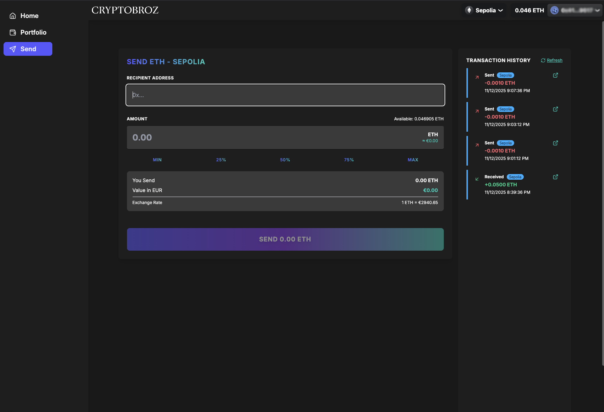

# cryptobroz-ui-starter

<div align="center">

[](https://opensource.org/licenses/MIT)
[](https://www.typescriptlang.org/)
[](https://nextjs.org/)
[](https://reactjs.org/)

</div>

Modern Web3 application with Next.js 16, React 19, TypeScript, RainbowKit, and Wagmi. Features wallet integration, real-time ETH price tracking, transaction history, and secure ETH transfers.

<div align="center">
  
</div>

## Features

- **Web3**: RainbowKit wallet connection, Wagmi hooks, Viem library, multi-chain support (Mainnet/Sepolia)
- **UI/UX**: Tailwind CSS, DaisyUI with custom purple/gold theme, responsive design
- **Price Tracking**: Real-time ETH/USD/EUR conversion via CoinGecko
- **Transactions**: Etherscan API integration for history, form-validated ETH transfers
- **Dev Tools**: TypeScript, ESLint 9, Prettier, Husky, Commitlint, T3 Env validation, MCP integration

## Quick Start

```bash
# Install
npm install

# Setup environment
cp .env.example .env.local
# Add your API keys to .env.local:
# - NEXT_PUBLIC_WALLETCONNECT_PROJECT_ID (from https://cloud.walletconnect.com)
# - NEXT_PUBLIC_ETHERSCAN_API_KEY (from https://etherscan.io/apis)

# Run development server
npm run dev
```

Open [http://localhost:3000](http://localhost:3000)

### Testing

Get free Sepolia testnet ETH from [Google Cloud Faucet](https://cloud.google.com/application/web3/faucet/ethereum/sepolia) to test safely without real funds.

## Pages

- **Home**: Hero section, feature showcase, quick actions
- **Send ETH**: Kraken-style interface with real-time conversion, quick amount buttons, form validation, transaction tracking
- **Portfolio**: Wallet overview, live ETH prices (USD/EUR), 24h change, transaction history (last 10 from Etherscan)

## Project Structure

```
src/
├── app/                # Next.js 16 app router pages
│   ├── api/prices/    # ETH price endpoint
│   ├── portfolio/     # Portfolio page
│   └── send/          # Send ETH page
├── components/         # React components
├── lib/env/           # T3 Env validation
└── config.ts          # Wagmi configuration
```

## Scripts

- `npm run dev` - Development server
- `npm run build` - Production build
- `npm run lint` / `npm run format` - Code quality

## AI Development Tools (MCP)

This project includes Model Context Protocol (MCP) integration for enhanced AI-assisted development with Claude Code.

### Chrome DevTools MCP

The Chrome DevTools MCP server provides AI coding assistants with browser automation and debugging capabilities.

**Setup:**

```bash
# Add Chrome DevTools MCP server
claude mcp add --transport stdio chrome-devtools -- npx chrome-devtools-mcp@latest

# Verify configuration
claude mcp list

# Check status in Claude Code
/mcp
```

**After setup**, reload VS Code to activate. Then Claude Code can:
- Navigate and interact with your app in Chrome
- Take screenshots and capture DOM snapshots
- Analyze console logs and network requests
- Run performance traces and extract metrics
- Test responsive designs on different devices
- Execute JavaScript and inspect page state

**Example prompts:**
- "Open localhost:3000 and take a screenshot"
- "Check the console for errors on the portfolio page"
- "Test how the send ETH form looks on iPhone 13"
- "Analyze the performance of the homepage"

Learn more: [Chrome DevTools MCP](https://github.com/ChromeDevTools/chrome-devtools-mcp)

## Security Notes

**For Production:**

- Remove `NEXT_PUBLIC_` prefix from Etherscan API key (move to server-side)
- Never commit `.env.local` file
- Test on Sepolia testnet before using mainnet
- Add server-side validation and rate limiting
- CSP configured in `next.config.ts` for Web3 connections

## Deployment

Deploy to [Vercel](https://vercel.com) or any Node.js hosting:

```bash
npm run build && npm run start
```

Configure environment variables in your hosting platform.

## License

MIT License - see [LICENSE.md](LICENSE.md)

---

**Note:** Demo application for educational purposes. Test thoroughly on Sepolia testnet before handling real cryptocurrency.
