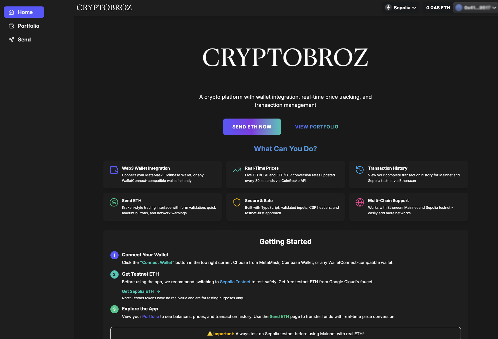
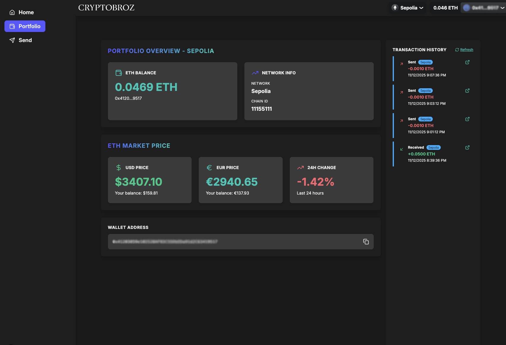

# cryptobroz-ui-starter 🚀

<div align="center">
  
</div>

<div align="center"><strong>Modern Web3 Application with Next.js 16</strong></div>
<div align="center">A production-ready crypto platform with wallet integration, real-time price tracking, and secure transaction management.</div>
<div align="center"><em>Built with Next.js 16, React 19, TypeScript, and RainbowKit</em></div>

<br />

<div align="center">

[](https://opensource.org/licenses/MIT)
[](https://www.typescriptlang.org/)
[](https://nextjs.org/)
[](https://reactjs.org/)

</div>

<br />

## 📸 Screenshots

<div align="center">

### 🏠 Home Page



### 💼 Portfolio Dashboard



### 💸 Send ETH Interface


</div>

---

## Features

### Core Stack

- ⚡️ **Next.js 16** - App Router with React 19
- ⚛️ **TypeScript** - Full type safety
- 🎨 **Tailwind CSS** - Utility-first styling
- 🌸 **DaisyUI** - Beautiful UI components with custom purple/gold theme
- 📱 **Responsive Design** - Mobile-first approach

### Web3 Integration

- 🔐 **RainbowKit** - Beautiful wallet connection UI
- 🪙 **Wagmi** - React Hooks for Ethereum
- 💰 **Viem** - TypeScript Ethereum library
- 🌐 **Multi-Chain Support** - Mainnet and Sepolia testnet
- 📊 **Real-Time Prices** - ETH/USD/EUR conversion via CoinGecko
- 📜 **Transaction History** - Via Etherscan API
- 💸 **Send ETH** - Kraken-style trading interface with form validation

### Development Tools

- 📏 **ESLint 9** - Find and fix problems
- 💖 **Prettier** - Consistent code formatting
- 🐶 **Husky** - Git hooks
- 🚓 **Commitlint** - Conventional commits
- 🖌 **Renovate** - Dependency updates
- 🚫 **lint-staged** - Lint staged files
- 👷 **PR Workflow** - Automated checks
- ⚙️ **EditorConfig** - Consistent coding styles
- 🗂 **Path Mapping** - `@` prefix imports
- 🔐 **CSP** - Content Security Policy
- 🧳 **T3 Env** - Type-safe environment variables

## Quick Start

### Installation

```bash
# Clone the repository
git clone https://github.com/yourusername/cryptobroz.git
cd cryptobroz

# Install dependencies
npm install
# or
pnpm install
```

### Environment Setup

1. Copy the example environment file:

```bash
cp .env.example .env.local
```

2. Add your API keys to `.env.local`:

```env
# WalletConnect Project ID (Required for wallet connection)
# Get your project ID at https://cloud.walletconnect.com
NEXT_PUBLIC_WALLETCONNECT_PROJECT_ID=your_walletconnect_project_id_here

# Etherscan API Key (Required for transaction history)
# Get your free API key at https://etherscan.io/apis
# NOTE: Keep this server-side only (without NEXT_PUBLIC_ prefix for production)
NEXT_PUBLIC_ETHERSCAN_API_KEY=your_etherscan_api_key_here
```

3. Update the WalletConnect Project ID in `config.ts`:

```typescript
export const config = getDefaultConfig({
  appName: 'CryptoBroz',
  projectId: process.env.NEXT_PUBLIC_WALLETCONNECT_PROJECT_ID || 'YOUR_PROJECT_ID',
  chains: [mainnet, sepolia],
  ssr: true,
});
```

### ⚠️ Important Security Note

**API Key Security:** The Etherscan API key is currently configured as `NEXT_PUBLIC_` which exposes it to the client-side. For production deployments:

1. **Remove the `NEXT_PUBLIC_` prefix** to keep it server-side only
2. Update `src/lib/env/server.ts` to include the Etherscan API key
3. The API route `/api/transactions` already proxies requests server-side
4. Update `TransactionHistory.tsx` to remove the client-side API key check

See the [Security Best Practices](#security-best-practices) section for detailed instructions.

### Getting Testnet ETH

Before using the app, we **strongly recommend** testing on Sepolia testnet first:

1. Switch your wallet to Sepolia Testnet
2. Get free testnet ETH from Google Cloud's faucet: [https://cloud.google.com/application/web3/faucet/ethereum/sepolia](https://cloud.google.com/application/web3/faucet/ethereum/sepolia)
3. Wait a few minutes for the testnet ETH to arrive
4. Start testing the app safely without using real ETH!

**Note**: Testnet tokens have no real value and are for testing purposes only. Always test thoroughly on testnet before using Mainnet with real cryptocurrency.

### Development

Start the development server:

```bash
npm run dev
# or
pnpm dev
```

Open [http://localhost:3000](http://localhost:3000) to see your app.

### Building for Production

```bash
npm run build
npm run start
```

## Features Overview

### 🏠 Home Page

- Hero section with gradient branding
- Feature showcase with interactive icons
- Quick actions to send ETH and view portfolio
- Responsive grid layout

### 💸 Send ETH

- Beautiful Kraken-inspired interface
- Real-time EUR/USD conversion
- Quick amount buttons (Min, 25%, 50%, 75%, Max)
- Form validation:
  - Ethereum address format validation
  - Balance checking
  - Minimum/maximum amount limits
- Mainnet warning for safety
- Transaction status tracking

### 📊 Portfolio

- **Wallet Overview**
  - Current ETH balance
  - Network information (Chain ID, Network name)
- **Market Statistics**
  - Live ETH/USD price
  - Live ETH/EUR price
  - 24-hour price change with color coding
  - Your balance in fiat currencies
- **Transaction History**
  - Last 10 transactions from Etherscan
  - Sent/Received indicators with icons
  - Transaction amounts and timestamps
  - Direct links to Etherscan explorer
  - Failed transaction badges
  - Loading states and error handling

### 🎨 Design System

**Color Palette:**

- Primary: Purple (#6A1B9A)
- Accent: Gold (#FFB300)
- Dark theme with subtle backgrounds

**Typography:**

- Display: Black Ops One
- Body: Inter

**UI Patterns:**

- Gradient buttons with hover animations
- Glass morphism cards
- Smooth transitions
- Consistent spacing and shadows

## Project Structure

```
src/
├── app/
│   ├── api/
│   │   └── prices/
│   │       └── route.ts        # ETH price API endpoint (avoids CORS)
│   ├── portfolio/              # Portfolio page
│   ├── send/                   # Send ETH page
│   ├── layout.tsx              # Root layout with providers
│   ├── page.tsx                # Home page
│   └── globals.css             # Global styles
├── components/
│   ├── CryptoNav.tsx           # Top navigation with wallet connect
│   ├── MainNav.tsx             # Secondary navigation menu
│   ├── Portfolio.tsx           # Portfolio component
│   ├── SendMoney.tsx           # Send ETH component
│   ├── Providers.tsx           # Wagmi & RainbowKit providers
│   └── Footer.tsx              # Footer component
├── lib/
│   └── env/
│       ├── client.ts           # Client-side env validation
│       └── server.ts           # Server-side env validation
└── config.ts                   # Wagmi configuration
```

## Scripts

- `npm run dev` - Start development server at `http://localhost:3000`
- `npm run build` - Create production build
- `npm run start` - Start production server
- `npm run type-check` - TypeScript validation
- `npm run lint` - Run ESLint
- `npm run lint:fix` - Fix ESLint errors
- `npm run format` - Format with Prettier
- `npm run format:check` - Check formatting

## Environment Variables

This project uses [T3 Env](https://env.t3.gg/) for type-safe environment variables.

### Required Variables

- `NEXT_PUBLIC_ETHERSCAN_API_KEY` - For transaction history (get from [Etherscan](https://etherscan.io/apis))
- `NEXT_PUBLIC_WALLETCONNECT_PROJECT_ID` - For wallet connection (get from [WalletConnect Cloud](https://cloud.walletconnect.com))

When adding additional environment variables, update the schema in:

- `./src/lib/env/client.ts` for client-side variables
- `./src/lib/env/server.ts` for server-side variables

## Content Security Policy

The CSP is configured in `next.config.ts` to allow necessary Web3 connections:

- RPC providers (Infura, Alchemy, Cloudflare, etc.)
- WalletConnect services
- Etherscan API
- CoinGecko API
- Web3Modal
- Thirdweb

Customize the CSP to add or remove allowed domains based on your needs.

## API Routes

### `/api/prices`

Server-side endpoint to fetch ETH prices from CoinGecko API. This avoids CORS issues and implements caching (30s) to prevent rate limiting.

**Response:**

```json
{
  "ethereum": {
    "eur": 3250.5,
    "usd": 3500.0,
    "usd_24h_change": 2.5
  }
}
```

## Customization

### Theme

Update colors in `tailwind.config.ts`:

```typescript
daisyui: {
  themes: [
    {
      dark: {
        primary: '#6A1B9A',     // Purple
        accent: '#FFB300',      // Gold
        neutral: '#212121',
        'base-100': '#1a1a1a',
        // ...
      },
    },
  ],
}
```

### Networks

Add or remove networks in `config.ts`:

```typescript
import { arbitrum, optimism } from 'wagmi/chains';

export const config = getDefaultConfig({
  chains: [mainnet, sepolia, arbitrum, optimism],
  // ...
});
```

## Security Best Practices

### 🔒 Critical Security Measures

#### 1. API Key Protection

**Current Status:** API keys are exposed client-side with `NEXT_PUBLIC_` prefix
**For Production:**

- Remove `NEXT_PUBLIC_` prefix from Etherscan API key
- Move to server-side environment configuration
- API routes already proxy requests securely

#### 2. Input Validation

✅ **Implemented:**

- Ethereum address format validation (`/^0x[a-fA-F0-9]{40}$/`)
- Balance checking before transactions
- Minimum/maximum amount limits
- Client-side form validation

⚠️ **Recommended Improvements:**

- Add server-side validation in API routes
- Implement rate limiting on API endpoints
- Validate chainId and address parameters server-side

#### 3. Environment Variables

- **Never commit `.env.local`** - Contains sensitive API keys
- Use separate keys for development and production
- Validate all environment variables at build time using T3 Env

#### 4. Safe Testing Practices

- **Always use Sepolia testnet first** before mainnet
- App includes mainnet warnings for safety
- Test thoroughly with testnet ETH (no real value)

#### 5. Content Security Policy (CSP)

- CSP headers configured in `next.config.ts`
- Restricts allowed domains and scripts
- Includes necessary Web3 providers

#### 6. Additional Recommendations

- Implement rate limiting (e.g., using `@upstash/ratelimit`)
- Add request logging with sensitive data masking
- Use error tracking service (Sentry, etc.)
- Implement proper error categorization (4xx vs 5xx)
- Add double confirmation for mainnet transactions

### 🛡️ Security Checklist

Before deploying to production:

- [ ] Remove `NEXT_PUBLIC_` prefix from Etherscan API key
- [ ] Update server-side environment configuration
- [ ] Add server-side input validation
- [ ] Implement rate limiting on API routes
- [ ] Remove API keys from console logs
- [ ] Review and minimize CSP `connect-src` domains
- [ ] Test all security measures on Sepolia testnet
- [ ] Configure production environment variables
- [ ] Set up error tracking and monitoring
- [ ] Review and update CORS policies
- [ ] Implement proper logging with data masking

## Troubleshooting

### Wallet Connection Issues

If wallet connection fails:

1. Ensure your WalletConnect Project ID is correct
2. Check that the domain is added to your WalletConnect project
3. Clear browser cache and try again

### Transaction History Not Loading

If transactions don't appear:

1. Verify your Etherscan API key is correct
2. Check you're on a supported network (Mainnet or Sepolia)
3. Ensure the wallet has transaction history

### Price Fetching Errors

If prices don't load:

- The app uses a server-side API route to avoid CORS
- Fallback prices are shown if CoinGecko is unavailable
- Check browser console for specific errors

## Deployment

### Vercel (Recommended)

1. **Prepare for Production:**

   ```bash
   # Run type checking
   npm run type-check

   # Run linting
   npm run lint

   # Test production build locally
   npm run build
   npm run start
   ```

2. **Push to GitHub:**

   ```bash
   git add .
   git commit -m "chore: prepare for production deployment"
   git push origin main
   ```

3. **Deploy to Vercel:**
   - Import project in [Vercel Dashboard](https://vercel.com)
   - Configure environment variables (see below)
   - Deploy

4. **Post-Deployment:**
   - Test wallet connection
   - Verify transaction history loads
   - Test sending ETH on Sepolia testnet
   - Monitor error logs

### Environment Variables for Production

**Required Variables:**

- `NEXT_PUBLIC_WALLETCONNECT_PROJECT_ID` - Your WalletConnect project ID
- `ETHERSCAN_API_KEY` - Server-side only (remove `NEXT_PUBLIC_` prefix)

**Optional Variables:**

- `NODE_ENV=production` - Automatically set by Vercel

### Alternative Deployment Platforms

#### Docker

```bash
# Build Docker image
docker build -t cryptobroz .

# Run container
docker run -p 3000:3000 --env-file .env.local cryptobroz
```

#### Traditional Hosting

```bash
npm run build
npm run start
```

Serve on port 3000 or configure your reverse proxy (nginx, Apache) accordingly.

## Contributing

Contributions are welcome! Please read our contributing guidelines and submit PRs.

## License

This project is licensed under the MIT License - see the [LICENSE.md](LICENSE.md) file for details.

## Acknowledgments

Built with:

- [Next.js](https://nextjs.org/)
- [Wagmi](https://wagmi.sh/)
- [RainbowKit](https://www.rainbowkit.com/)
- [Viem](https://viem.sh/)
- [Tailwind CSS](https://tailwindcss.com/)
- [DaisyUI](https://daisyui.com/)
- [CoinGecko API](https://www.coingecko.com/en/api)
- [Etherscan API](https://etherscan.io/apis)

---

**Note:** This is a demo application for educational purposes. Always conduct thorough testing before handling real cryptocurrency transactions.
